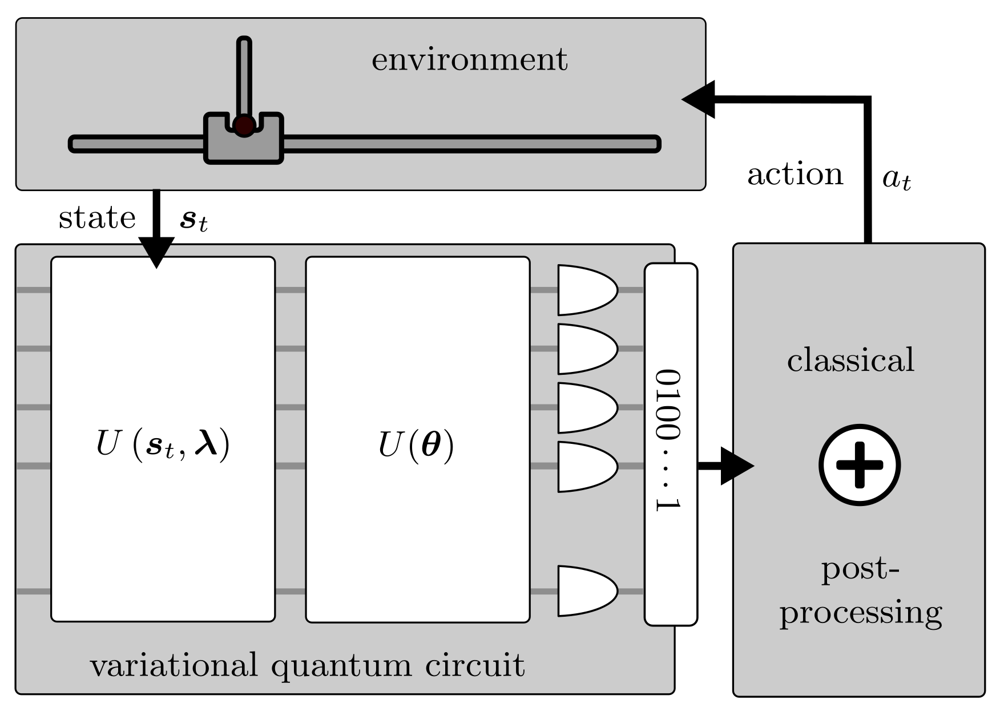
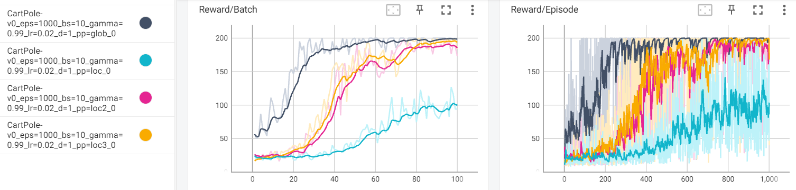

# Quantum Policy Gradient Algorithm with Optimized Action Decoding
This is a Python toolbox that implements the methods described in [Meyer et al., "Quantum Policy Gradient Algorithm with Optimized Action Decoding", Proceedings of the 40th International Conference on Machine Learning, PMLR 202:24592-24613, 2023.](https://proceedings.mlr.press/v202/meyer23a.html)



---

## Requirements

### Packages

Following packages were used to develop the toolbox (it may also work with other versions):

* ```python==3.7.13```
* ```pytorch==1.12.1```
* ```gym==0.26.1```
* ```qiskit==0.38.0```
* ```qiskit_machine_learning==0.4.0```
* ```tensorboard==2.10.0```
  * only required for a nicer visualization of results

### Anaconda environment

A ```YML``` file to create an anaconda environment for the toolbox is provided in ```environment.yml```

---

## Implemented Functionalities

### Quantum Policy Gradient Algorithm

* Formulation with raw-VQC policy
  * Proposed in "Parametrized Quantum Policies for Reinforcement Learning", Jerbi et al., 2021
  * Action selection based on projection to computational basis
* Automated training via ```TorchConnecter``` of ```qiskit_machine_learning``` module
  
### Action decoding Methods

* Global post-processing function
  * Uses efficient construction proposed in our paper
* Local post-processing function
* Q-local post-processing functions
  * Only implemented for environments with 2 actions

### Accessing the Results

* Training history is automatically saved to ```results\EXP_NAME``` and can be accessed via ```tensorboard```
* Final trained parameters are stored to ```results\EXP_NAME\trained_weights.npy```
---

## Usage

Navigate (```cd```) to the root of the toolbox ```qpg_algorithm_with optimized_action_decoding```.

<details>
  <summary><b>Training</b></summary><br/>
  
  The training can be started via ```main.py```

The script provides the following options:

  ```
main.py [-h] [--environment {CartPole-v0,CartPole-v1}] [--episodes N]
               [--batch_size N] [--gamma F] [--learning_rate F] [--depth N]
               [--pp_function PP_FUNCTION] [--q_local N] [--exp_name EXP_NAME]

```

  Detailed information and options can be obtained by:
  ```
  python3 main.py -h
  ```

The training progress is prompted to the commandline during training and saved to ```results``` afterwards.

</details>

<details>
  <summary><b>Recreating our Results</b></summary><br/>

The main part of our work compares QPG models with different action decoding strategies. We have implemented various of these concepts in this framework, which allows to compare the results.

* In order to train a model with a global post-processing function (which is auto-generated with the technique described in our work), one can run:
  ```
  python main.py --pp_function=glob
  ```  
  
* Training with a local (as local as possible for more than two actions) can be executed with:
  ```
  python main.py --pp_function=loc
  ```
  
* Results for choices inbetween, e.g. 3-local post-processing functions can be obtained via:
  ```
  python main.py --pp_function=loc --q_local=3
  ```
  Note, that this choice is only available for environments with two actions. The implementation checks whether the choice is possible, i.e. the argument of ```--q_local``` must be smaller than the number of qubits.

</details>

<details>
  <summary><b>Pre-Computed Models</b></summary><br/>

As training the models is very time-consuming, we provide some pre-trained models with this framework in ```results```. 
The training performance of models with a globality value of 1, 2, 3, and 4 (i.e. global) is displayed below:



We have used the following hyperparameters for the training procedure:
  ```
  python main.py --environment=CartPole-v0 --episodes=1000 --batch_size=10 --gamma=0.99 
                 --learning_rate=0.02 --depth=1
  ```

These hyperparameters slightly deviate form the settings noted in the paper, most importantly the learning rate.
This is down to the fact, that the current version of the ```TorchConnector``` does not allow separate learning rates for variational and state scaling parameters.
To balance this out, we had to select a different value to balance this out.

Note, that the results also do not exactly represent the plot in our paper. We averaged over 20 independent experiments there, while the plot above only represents one training routine each.
For our original experiments we had access to some HPC devices. Training several instances on you local machine, however, would be very time-consuming.
The less-significant difference in performance of the models with globality values of 2 and 3 is also down to this less representative sample size.
When training yourself, you also might experience slight deviations. However, the qualitative results should be preserved.


</details>

<details>
  <summary><b>Displaying Results</b></summary><br/>

Results are saved to a dictionary with an auto-generated path of the form ```results/EXP_NAME```.

The result of a specific experiment can be visualized via:
  ```
  tensorboard --logdir results/EXP_NAME
  ```

Different experimental results can be compared with:
  ```
  tensorboard --logdir results
  ```

</details>

---
# Citation

If you use this code or results in your paper, please cite our work as

```
@inproceedings{meyer2023quantum,
  title={Quantum Policy Gradient Algorithm with Optimized Action Decoding},
  author={Meyer, Nico and Scherer, Daniel D. and Plinge, Axel and Mutschler, Christopher
  and Hartmann, Michael J.},
  booktitle={International Conference on Machine Learning},
  pages={24592--24613},
  year={2023},
  organization={PMLR}
  url={https://proceedings.mlr.press/v202/meyer23a.html}
}
```
